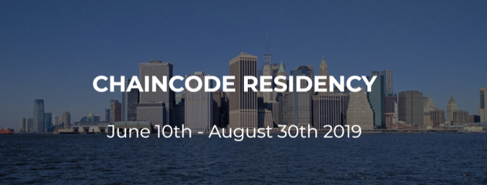

In 2019, we hosted the third [Chaincode
Residency](https://residency.chaincode.com/), our most ambitious to date. I
co-organized and co-hosted the program, and also gave a series of technical
talks:

#### Security Models

- Videos
  - [Security model proposals](https://www.youtube.com/watch?v=6gGcS4N5Rg4&list=PLpLH33TRghT0z4nnoJx6646nfsMFvnVwF&index=4)
  - [Alternative UTXO set proposals](https://www.youtube.com/watch?v=F3BCP0wiYOw&list=PLpLH33TRghT0z4nnoJx6646nfsMFvnVwF&index=5)
- [slides](./security-slides.pdf)
- [notes](./security-notes.pdf)

#### Wallet Development

- [video](https://www.youtube.com/watch?v=j0V8elTzYAA&list=PLpLH33TRghT0z4nnoJx6646nfsMFvnVwF&index=8)
- [slides](./wallet-slides.pdf)
- [notes](./wallet-notes.pdf)

