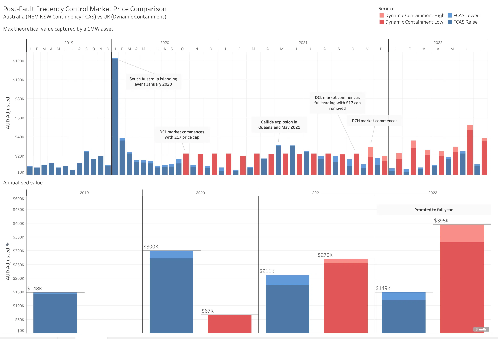

_Originally [published on the Gridcognition Blog][original blog post]_.

## Introduction

In a [recent blog post][london sydney solar], we compared the financial case
for installing solar (and optionally battery storage) to a supermarket in
Australia versus the UK. That analysis only considered using the solar
generation and battery storage to reduce spend on energy imported from the
grid, and showed that although the solar irradiation in London was around
two-thirds that of Sydney, the savings were much greater due to the nature of
the network tariffs available in each location.

However, when considering the economics of deploying distributed energy
resources, reducing spend on energy is only part of the picture. Grid edge
assets are able to participate in markets and provide network support services.
These new revenue streams can greatly affect the economics of the project and
strengthen the case for deploying new assets. In this post we’ll look at one
type of market, contingency frequency response, and compare the revenue
opportunities in Australia and the UK.

## What is Contingency Frequency Response?

The primary role of the System Operator is to maintain the security and
reliability of the electricity grid. As well as operating a market for the sale
and purchase of electrical power in specified time blocks, the operator must
also procure reliability services in order to contain the system within its
specified operating parameters (regulation services), and to quickly bring the
system back into those operating parameters in the case of a fault (contingency
services).

One operating parameter that must be maintained for the grid to remain stable
is the frequency of the A/C being delivered. In both the UK and Australia, the
frequency of the grid is 50Hz, with a narrow operating band around that
specified frequency (49.8Hz – 50.2 Hz in the UK, 49.85Hz – 50.15 Hz in
Australia). If the frequency strays outside that band, the system operator
moves quickly to adjust generation or load in order to maintain the balance of
supply and demand in the system. Although the System Operator is controlling
the dispatch of generation and load, those resources are provided by market
participants, and competitively bid for in specified time blocks.

In Australia, AEMO operates six FCAS ([Frequency Control Ancillary Services][fcas])
markets in the National Energy Market: fast raise and lower; slow raise and
lower; and delayed raise and lower. In the UK, National Grid ESO operates two
DC ([Dynamic Containment][dc]) markets: low DC and high DC. These are relatively new
services, with a soft launch for low DC in late 2020 and a full launch with low
and high DC in late 2021.

## How does FCAS compare to DC?

We’ve analysed what the FCAS and DC markets have been worth for the last few
years. Going back to 2019 means we can include some of the more spectacular
contingency events seen on the Australian NEM. For 2022, we’ve prorated the
January-July figures, for an easier like-for-like comparison with previous
years.

Our analysis shows that so far in 2022, the value that UK battery owners can
capture from participating in the DC markets is over twice that of their
Australian counterparts selling into the FCAS market. It remains to be seen
whether those high prices in the DC markets will remain, or whether new
entrants will drive down the price.

Asset owners will also want to try to stack frequency support with some other
value streams like wholesale arbitrage. On that front the NEM in Australia is
very different from the UK with $16,000/MWh top-to-bottom price swings and 5
minute settlement periods which are favourable to rapid operating
characteristics of batteries.

## Notes

- The six contingency FCAS markets in the NEM have been rolled up into two
  (FCAS Raise and FCAS Lower)
- The Australian NEM prices are taken from the NSW trading region
- Dynamic Containment Low (DCL) is equivalent to FCAS Raise and DCH to FCAS
  Lower
- All values presented in Australian dollars

[original blog post]: https://gridcog.com/blog/comparing-contingency-frequency-control-markets-in-australia-and-the-uk
[london sydney solar]: https://gridcognition.com/is-london-a-better-investment-for-solar-than-sydney/
[fcas]: https://aemo.com.au/en/energy-systems/electricity/national-electricity-market-nem/system-operations/ancillary-services
[dc]: https://www.nationalgrideso.com/industry-information/balancing-services/frequency-response-services/dynamic-containment
