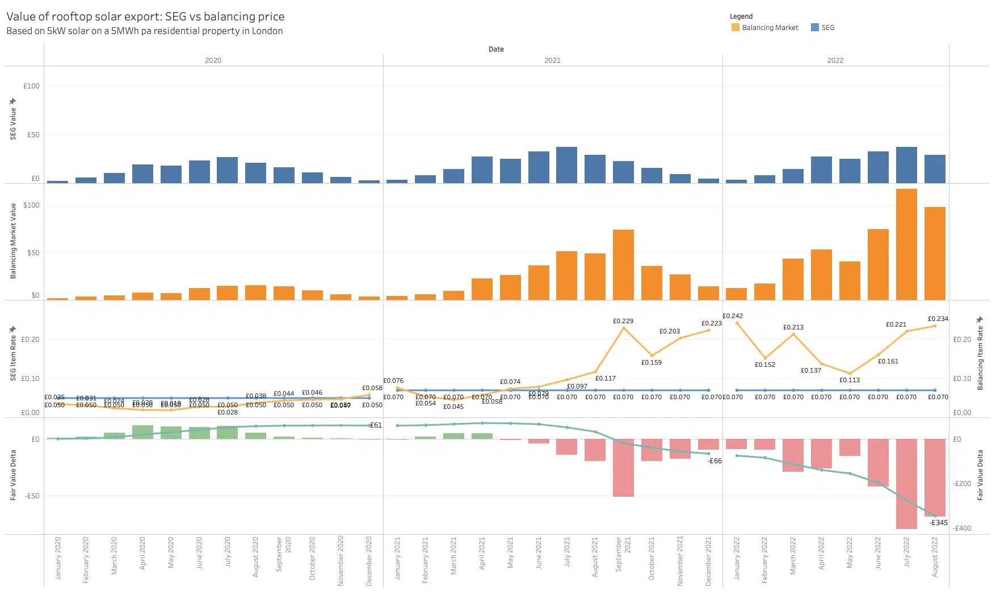
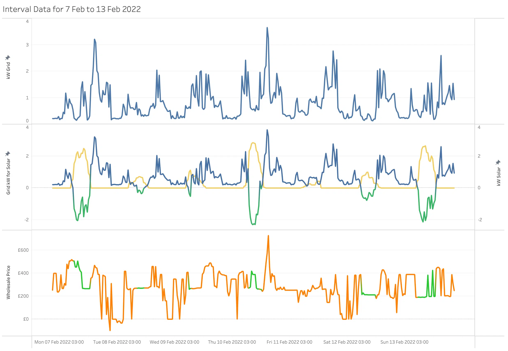

_Originally [published on the Gridcognition Blog][original blog post]_.

### Introduction

Our [previous post][] compared the value that residential PV solar owners in
Australia can get from the various Feed in Tariff (FiT) schemes in different
states. We found that the relative economics of wholesale market prices and FiT
schemes varied widely, from pretty generous FiT pricing in Melbourne and
Adelaide, through to much less attractive pricing in Sydney and Brisbane.

Today, we’re going to do a similar exercise for the UK. Like Australia, the UK
has two electricity markets, and for today’s analysis we’re going to be
focusing just on Great Britain (Northern Ireland shares an electricity market
with Ireland).

England, Scotland, and Wales share a single energy market with the same
renewables regulations and incentives. We’ll start by looking at GB’s
renewables incentive schemes before we dive into the modelling.

### The Feed in Tariff and Smart Export Guarantee

The UK’s old [Feed in Tariff][fit] scheme was launched in 2010 and offered fixed
export tariffs for low carbon and renewable generators, segmented by technology
type, capacity and energy efficiency. That scheme was closed to new
participants in March 2019, although those already signed up to the FiT will
continue to be eligible for the remainder of their 20 or 25 year term.

In January 2020, the government launched the Smart Export Guarantee, a new
scheme for small-scale low-carbon generators. Unlike the FiT, the SEG doesn’t
dictate the rate for exported energy. Instead, it simply compels large energy
suppliers (those with more than 150,000 domestic customers) to offer an export
tariff.

The SEG does not determine the terms of the tariff, except that the rate must
be “above zero”. Small-scale generators are therefore motivated to shop around
for the best export tariff. Interestingly, the generator can choose different
suppliers as their SEG provider and their energy provider.

### The SEG landscape

Ofgem publishes a [list of all SEG licensees][seg licensees] every year. For
the third year of the scheme (2022/23), there were twelve mandatory licensees
(suppliers with more than 150,000 domestic customers) and three voluntary
licensees (smaller suppliers that chose to opt in to the scheme).

One of the mandatory licensees (Bulb) has been placed in special administration
but is still accepting new customers, and two of the voluntary licensees
(Cilleni Energy Supply and Smart Pay Energy) do not appear to have active
websites. Residential solar owners therefore do have a bit of choice on where
to sell their excess energy generation. Just like for picking an energy
provider, there are [price comparison websites][seg comparison] to help
generators find the best deal.

All of the active SEG licensees offer fixed rate export tariffs, with Octopus’s
Outgoing Fixed tariff being the most generous at 7.5p/kWh and E’s SEG
January2020v.1 tariff the stingiest at 1p/kWh. Most of the other fixed rate
tariffs sit in the 3-6p/kWh range. Given that most electricity consumers will
be on an import rate fixed by
[Ofgem’s energy cap of 52p/kWh from October 1st][ofgem energy cap], all of
these fixed rate tariffs are leaving the generator significantly out of pocket.

A supplier buying energy from a small-scale generator at 4p/kWh and selling at
52p/kWh is making a 13x markup (ignoring distribution and transmission losses).
That’s a pretty juicy deal for the supplier, and a pretty bad deal for the
solar household.

Octopus Energy is the only supplier to advertise a variable rate tariff, the
_Outgoing Agile_ tariff. That tariff has
[significantly outperformed][octopus agile] the fixed rate tariffs in recent
months, which is perhaps unsurprising given the elevated balancing market spot
prices over that period. The Outgoing Agile tariff is only available to
customers who use Octopus as their energy provider.

### The model

Just as [we did in Australia][previous post], we’ve modelled a typical house
with a 5kW PV solar system, but this time we’ve transported it to south east
London (and remembered to move the panels to our south-facing roof).

London’s high latitude and cloudy skies mean we’re not going to get as many kWh
out of our PV system as we did in sunny Perth or Sydney, but our previous
analysis has shown that even with lower irradiance,
[London may be a better investment for C&I solar][london solar post] due to the
available network tariffs. Let’s see how the investment stacks up when the
owner is on an SEG tariff.

We’ve assumed an SEG flat rate of 5p/kWh for 2020, rising to 7p/kWh for
2021-22. That’s the right ballpark, but if anything may be a little generous
given the tariffs that are currently available.

### Results

Wholesale energy prices were suppressed throughout 2020, so even with a low
export rate of 5p/kWh, households feeding in to the grid would have been ahead.

However, since mid 2021 wholesale prices have increased dramatically – a
combination of increased demand after lockdowns and gas price rises driven by
supply chain issues and most recently Russia’s invasion of Ukraine. SEG rates
have not kept pace with those prices, even as suppliers pass increased costs
onto their customers.

If you thought [Brisbanites and Sydneysiders][previous post] were getting a bad
deal, then Londoners have it even worse. In the first 8 months of 2022, our
model household would get paid £345 below the ‘fair value’ wholesale price for
their exported energy.

Here’s the interval data for a typical week in February for the data fiends.
Even in the middle of winter, the solar system is exporting some energy to the
grid on most days.

### Conclusion

All of the fixed rate SEG tariffs significantly underpay the generator compared
to the fair market value of the energy they’re exporting. Even Octopus Energy’s
relatively generous Outgoing Fixed tariff offers far below the market price.

It’s therefore unlikely that you’ll get a fair price from your SEG supplier for
exported energy, which creates a very strong incentive for households to
self-consume all of their generated electricity, by shifting loads to the
middle of the day or adding new loads like electric vehicle charging, electric
heat pumps, and home batteries.

In our next post we’ll look at the other financial aspects of installing solar,
including what the expected payback period is for different sized systems, and
opportunities for load shifting. We’ll also look at recent installation numbers
for small-scale solar systems in the UK.

It’s our hope that as the rate of rooftop solar adoption increases and high
prices cause energy prosumers become more price-sensitive, we’ll see SEG
licensees improve the export tariffs that they offer. Who knows, perhaps the
SEG landscape may one day evolve into a truly competitive market where the SEG
licensees are competing on the rate they offer generators!

### Notes

- The load data is for a typical UK household with an annual consumption of
  5MWh, with a [load shape from the Greater London Authority][london load shape].
- The PV system has a capacity of 5kW oriented south with a tilt of 35°.
- All generation is self-consumed if possible. Excess generation is exported to
  the grid under a fixed rate SEG tariff.

[original blog post]: https://gridcog.com/blog/solar-export-tariffs-in-gb
[previous post]: https://gridcog.com/blog/solar-feed-in-tariffs-in-australia-whos-getting-a-raw-deal
[fit]: https://www.ofgem.gov.uk/environmental-and-social-schemes/feed-tariffs-fit
[seg]: https://www.ofgem.gov.uk/environmental-and-social-schemes/smart-export-guarantee-seg
[seg licensees]: https://www.ofgem.gov.uk/publications/seg-supplier-list
[seg comparison]: https://www.theecoexperts.co.uk/solar-panels/smart-export-guarantee#link-smart-export-guarantee-rates
[ofgem energy cap]: https://www.ofgem.gov.uk/check-if-energy-price-cap-affects-you
[octopus agile]: https://www.energy-stats.uk/octopus-agile-outgoing-export-london/
[london solar post]: https://gridcog.com/blog/is-london-a-better-investment-for-solar-than-sydney
[london load shape]: https://data.london.gov.uk/dataset/smartmeter-energy-use-data-in-london-households
