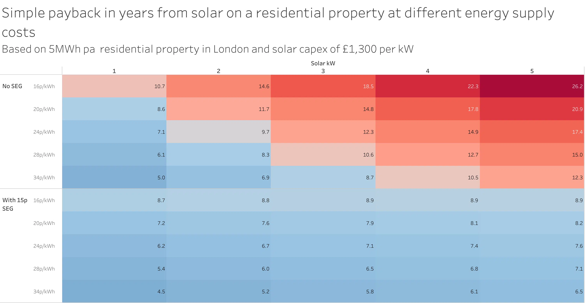

_Originally [published on the Gridcognition Blog][original blog post]_.

### Introduction

Our [previous post][] looked at the difference between what a residential solar
owner in London might be paid under the various SEG export tariffs and what
that energy would be worth on the balancing market. We found that the export
tariffs on offer were much lower than both the very high wholesale prices and
the import tariffs (for energy consumption rather than generation) that the
suppliers are offering to customers.

However, installing a PV system could still be a good investment for households
who self-consume the majority of generated energy and so reduce the amount of
energy purchased from their supplier. With the current energy price guarantee
at an eye watering 34p/kWh from October 1st, solar is becoming an increasingly
attractive option for many households.

### Assumptions

We modelled out the following assumptions in the Gridcognition software to see
how long it’d take to pay off the investment in a new residential solar system:

- The total annual consumption for our typical household is about 5MWh. 30-min
  resolution interval data [provided by the Greater London Authority][london load shape].
- The property is located in SE London. We get solar irradiance data for a typical
meteorological year from [Solcast][].
- Sensitivity to solar system size assessed
using 1kW, 2kW, 3kW, 4kW and 5kW, all oriented 180° south at a tilt of 35°.
- Sensitivity to energy supply costs assessed using 16p, 20p, 24p, 28p and 34p
per kWh. That more or less bookends the pricing from the lows of the Covid era
to October’s price cap.
- Model is run both with and without export under an
15p/kWh Smart Export Guarantee (SEG) tariff. That’s the best fixed rate
available on the market today (Octopus Energy’s Fixed Outgoing tariff).
- Solar
capex costs assumed to be £1,300 per kW.

### Results

The payback period is very sensitive to both the import and export tariffs, as
you may expect. At one extreme, a 5kW array with a 16p/kWh import tariff and no
export tariff would take 26.2 years to pay off, which is beyond the rated
lifespan of many panels. At the other extreme, a 1kW array with 34p/kWh import
and 15p/kWh export would be paid off in 4.5 years.

Since payback time will often favour lower capex at the expense of longer-term
value, let’s also take a look at NPV after 10 years, based on a 5% discount
rate:

Even without an export tariff, any size of solar array is a worthwhile
investment if import tariffs stay at their elevated rate of 34p/kWh and excess
generation can be sold at 15p/kWh. For systems without any export, only arrays
sized at 1kW or 2kW will have a positive NPV after 10 years.

#### Interval data

Here’s a closer look at the energy flows for a 3kW system during the month of
June.

In a typical week in summer, the PV system is exporting significant amounts of
energy to the grid, and also reducing peak demand by just under one third.

Even in winter, the PV system is exporting some excess generation to the grid
on sunny days, but isn’t making much of a dent on consumed energy or peak
demand.

Across the year, a significant portion of the house’s energy demands are met by
the PV system.

### Analysis

- Assuming the import rate remains at 34p/kWh (and that’s a big assumption), a
  4.5 year payback period for a 1kW system is a great deal. If you can afford
  (or get financing for) a small solar array and you have a suitable roof, it’s
  probably a good investment.
- At 34p/kWh, any size PV system gives a positive return after 10 years
  (assuming an export tariff of 15p/kWh).
- There’s a huge amount of uncertainty in future energy prices. They’ll be
  impacted by both unpredictable global events and also government
  interventions in the energy market. Making investment decisions based on
  forecasted prices obviously carries risks. On the other hand, households may
  like the fact that generating their own energy reduces their exposure to
  volatile and unpredictable energy markets.

### Are Increasing Wholesale Prices Impacting Solar Installations?

Another way to answer the question of whether PV systems are a good investment
is to look at whether new systems are actually being deployed. Fortunately, the
Department of Business, Energy and Industrial Strategy publishes
[monthly figures of new solar capacity installations][solar installations],
broken down by deployment size.

Here’s the monthly small-scale (<50kW) installations in the UK over the past 12
years:

It’s been quite a rollercoaster for the UK residential solar industry! The
peaks in early 2012 and 2016 coincide with changes to rates and rules of the
FiT scheme, and the huge outlier in March 2019 lines up with the end of the
scheme and the rush to get installations accredited before the deadline of
April 1st. Since that date, small-scale solar installations have been growing
steadily without subsidies, with just a small blip down in early 2020 during
the COVID lockdowns and a noticeable uptick since the beginning of 2022.

Let’s zoom in on the last three years and compare installations with Australia,
which has a much larger and more mature residential solar industry. We took
June 2019 as a baseline to avoid any distortions caused by the ending of the
FiT scheme, since it’s likely that many installations were brought forward to
meet the deadline and inventory and sales pipelines would be drained for a few
months afterwards.

The Australian data was taken from [Sunwiz][], and includes all systems up to
100kW. The comparison therefore isn’t exactly like-for-like, but is
directionally correct.

Australia starts from a much higher baseline of 178 MW of installation per
month. However, there’s only moderate growth in rate of installation, with
~200-300MW for most of the period. Still, that’s around 3GW of new installed
capacity per year!

The UK, on the other hand, starts from a much lower baseline of 8MW in June
2019, but rises to 56MW in September 2022. That’s an increase of over 650%.

### Conclusion

As energy wholesale prices continue to be elevated and volatile, and retail
tariff rates reflect those high prices, households’ economic case for
residential solar installations will only grow stronger. Even without feed-in
tariffs or SEG tariffs that accurately reflect the fair value of exported
energy, it’s likely that more and more households will install small-scale
solar generation to save money on their energy bills.

[original blog post]: https://gridcog.com/blog/comparing-contingency-frequency-control-markets-in-australia-and-the-uk
[previous post]: https://gridcognition.com/solar-export-tariffs-in-gb/
[london load shape]: https://data.london.gov.uk/dataset/smartmeter-energy-use-data-in-london-households
[solcast]: https://solcast.com/
[solar installations]: https://www.gov.uk/government/statistics/solar-photovoltaics-deployment
[sunwiz]: https://www.sunwiz.com.au/
