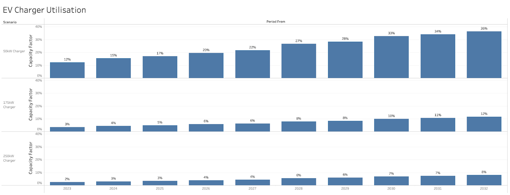

_Originally [published on the Gridcognition Blog][original blog post]_.

### Introduction

A few months ago, we published an article on
[The Economics of Public EV Charging][previous post] in Australia. In that
article, we attempted to find the price that owner-operators of EV chargers
should charge users in order to break even on their investment over a 10 year
period. The analysis was run for different size EV chargers located within a
shopping centre in different cities across Australia, since energy and network
costs vary widely across the country. 

Public EV charging prices have become a hot topic in UK news in recent weeks,
with articles comparing the driving costs of EVs and ICE vehicles, and recent
stories about multiple EV charger operators introducing time-of-day dynamic
pricing. It seemed like a good time to dive in and do some analysis on the
financials of operating an EV charger in GB.

In this analysis, we selected a single site in London for our shopping centre
(network costs vary much less by region in GB than in Australia), and ran the
simulation for a 50kW, 175kW and 250kW charger.

### Assumptions

Just like for Australia, we needed to start with a number of assumptions about
the physical and economic characteristics of the EV charger and its usage.

#### Asset cost

We model a shopping centre adding a single EV charger of each type, where the
cost of the charger is amortised over the 10 year duration of the project, with
a fixed leasing cost that covers installation, operation and maintenance. We
use similar infrastructure costs as for Australia, converted into GBP.

#### Energy supply costs

We’re not an energy price forecaster, so once again we turned to our friends at
[Cornwall Insight][] for our wholesale energy price curve. We’ve used the central
case forecast for GB Day Ahead prices. To keep the model simple, we assume that
the site owner takes the wholesale price for energy.

#### Network Costs

The shopping centre is located in London, and we’ve used the UK Power Networks
London Low Voltage Site Specific tariff. We also included triad charges -
although these are being phased out, until we know what they’ll be replaced by
these are the best indication of what future transmission use-of-system costs
might be.

#### Physical Constraints

As for the Australian analysis, we assume no physical constraints for the site
connection. Although EV chargers are demand-heavy, we’re co-locating it within
a site that already has a peak demand of around 900kW. That means that the EV
charger’s demand does not have a significant impact on the site’s peak demand.

In other situations, physical constraints may require the site owner to reduce
the peak demand impact of the EV chargers on the site connection, either by
restricting charging events or by investing in co-located energy assets such as
battery storage.

#### Charger Utilisation

We use the same assumptions about charger utilisation as for our
[previous post][] - 5 charging events of 30kWh per day in 2023, increasing by
around 350% over the duration of the 10-year period. The chargers are in use
during the opening hours of the shopping centre, from 7am to 8pm. That limits
the maximum possible load factor to be around 54%.

### Modelling

Our standard approach when modelling behind-the-meter projects is to
begin with a baseline scenario that captures the physical and economic
characteristics of the site under business-as-usual conditions. We configure
our baseline assumptions, which consist of:

- Physical aspects of the site, such as location, grid connection and constraints
- Electricity demand for the site. In this project, we simply load in historical
  data, and then cast that forward to forecast future demand.
- Economic characteristics, including markets that the site is exposed to,
  network and retail tariffs, and cash flows between multiple participants For
  this analysis, our business-as-usual scenario is very straightforward. We have
  a demand curve for the shopping centre, along with a network tariff and
  wholesale energy market prices that are both costs for the shopping centre
  owner.

We then build three alternative scenarios, each of which models a different
sized EV charger. For each scenario, we configure the leasing cost of the asset
(assuming zero capex since the asset is leased for a fixed annual cost), along
with the expected utilisation model. The simulation uses an agent-based model
to forecast the time of arrival of vehicles within the charging window. If a
vehicle arrives while the charger is in use, it joins a queue and waits until
the charger becomes available to start charging. If the queue length exceeds
one hour, then the driver leaves without charging. This has implications for
the low power charger in later years - the number of cars that want to use the
charger exceeds the charger’s capacity for delivering energy at certain times,
meaning potential customers are turned away.

The graphs below show the total energy delivered and load factor of each
charger for each year.

For each half-hour time interval, the simulation software generates the total
site demand, including both the pre-existing demand from the shopping centre
and the additional demand from the EV charger. In the image below, the top
graph is the energy demand in the business-as-usual scenario, and the bottom
graph is the energy demand with a 50kW charger. The blue trace represents the
total grid import, and the grey trace represents the additional demand from the
EV chargers. This time period is pulled from 2023 in the project, when EV
charger demand is at its lowest.

The total cost of supplying the demanded electricity (including the energy
wholesale price and network charges) is calculated for both the baseline and
50kW charger scenarios. The difference between these is added to the annual
lease for the EV charger to obtain the total cost for the charger. Dividing
this cost by the energy delivered gives the breakeven price for the EV charger.

### Results

If we graph the breakeven price of the EV chargers across the length of the
project, the results are perhaps unsurprising:

1. The more powerful the charger, the higher the charging price needs to be for
   the asset owner to break even. That’s because the higher asset leasing costs
   are shared between the same number of customers, and the higher power demand
   also results in slightly higher network costs.
1. Over the 10 year project period, the breakeven price drops by over 60%. This
   is due to the forecast for wholesale energy dropping over time, and the
   increasing utilisation of the EV charger meaning the fixed overheads are shared
   over a larger customer base.

Visualised in table format, we can dig into the data in more detail:

Interestingly, the breakeven price for a 250kW charger is 60% higher than a
50kW charger in 2023 (52.9p/kWh against 33.2p/kWh), but only 43% higher in 2032
(19.9p/kWh against 13.9p/kWh).  This is because the lower powered charger is
not able to deliver as much energy, and has to turn away potential customers.
The fixed costs are therefore shared over fewer charging events.

If we drill down into the cost stack, we can see where the difference in
breakeven price originates. The higher powered chargers have a higher leasing
cost, which dominates the cost stack in early years. They also result in
marginally higher network costs. Over time, the fixed asset opex dominates less
due to higher utilisation and the difference in network costs increases, but
not enough to offset the reduced effect of the opex.

Finally, we might want to ask ourselves what the breakeven price is over the
entire 10 year project:

According to our model, EV charger operators offering charging at those prices
would be losing money today. However, we do
[know that many EV charging companies are operating at a loss today][ev charger operator problems]
 in order to gain market share. Presumably their hope is that as
energy prices decrease and EV adoption picks up, they’ll start to turn a profit
on those charging stations. It’s impossible to say how that’ll work out for
them, except that they’ll need to have deep pockets in the meantime!

### Conclusion

Owning and operating public EV charging infrastructure in a profitable way is a
complex challenge and one that the market is only just beginning to tackle.
Companies investing in EV charging today are having to take a view on a range
of important assumptions, including charger utilisation, the physical behaviour
of the hardware, site and network constraints and of course energy supply cost,
both in terms of the commodity and network.

Being able to quickly model different deployment scenarios with different
physical and commercial assumptions is therefore critical to building
confidence in investment and pricing decisions.

[original blog post]: https://gridcog.com/blog/ev-charging-uk
[previous post]: https://gridcog.com/blog/the-economics-of-public-ev-charging
[cornwall insight]: https://www.cornwall-insight.com/
[ev charger operator problems]: https://www.canarymedia.com/articles/ev-charging/shell-buys-ev-charger-operator-volta-for-pennies-on-the-dollar
